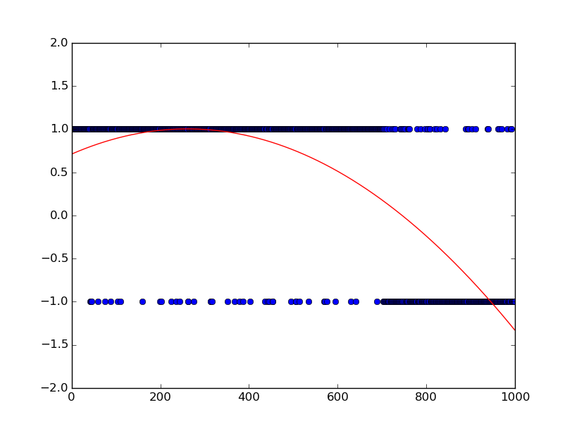
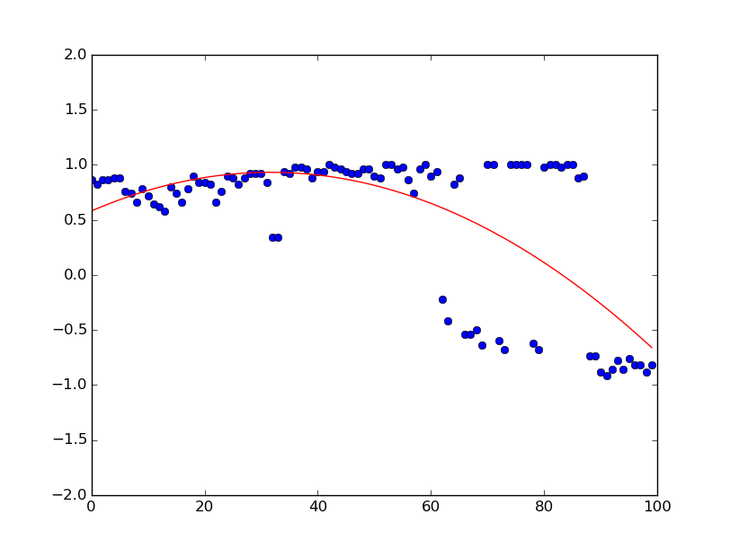
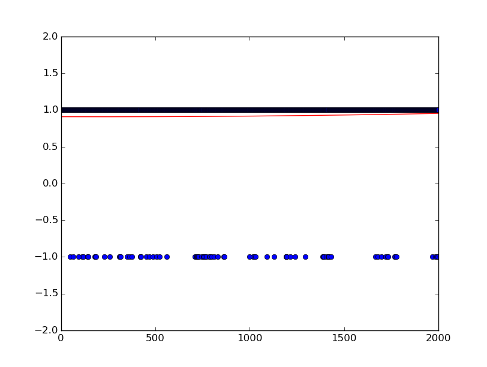
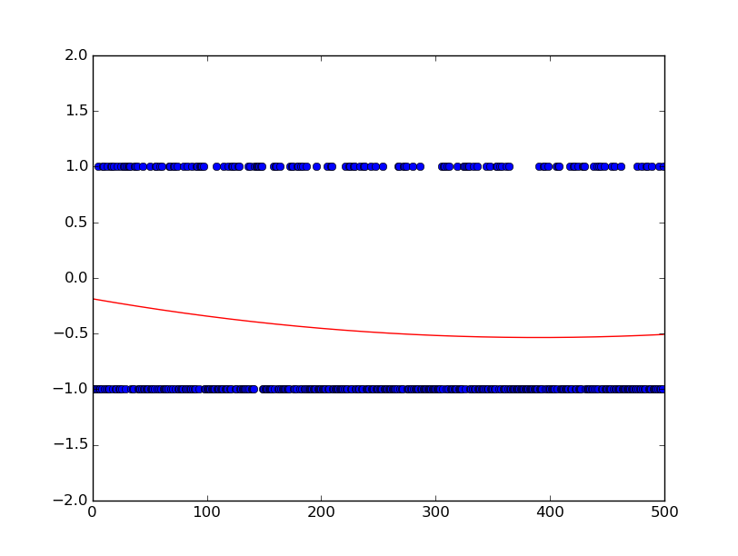
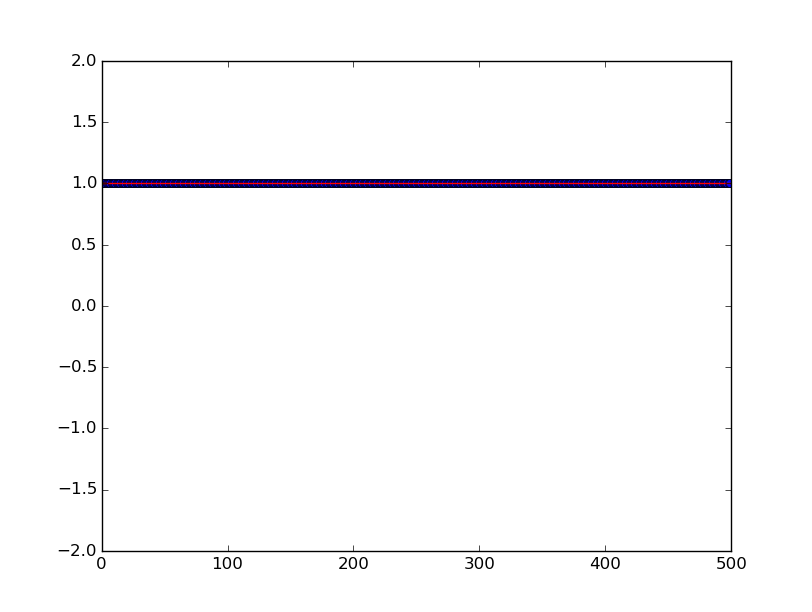

# Connect-4 AI
---

Minimax Q-Learning with Deep Neural Network for Connect-4

### Abstract

Prior to implementing Connect-4, I tried to apply simulating a Q-value function with a neural network that takes the current board state as input and output the corresponding value function. However, in both Tetris and 2048, the model became overly complex due to *imperfect information* (probabilistic computation of next-state). I have also previously had notable success with Tic Tac Toe, so I decided to model a relatively simple system: Connect-4, in which the number of possible actions are **constrained**, and the next state is **perfectly known**.

### Tasks
- [x] Implement Game Logic
	- [x] Placing Step
	- [x] Evaluating Rewards
	- [x] Computing Terminal State

- [ ] Implement Agent Logic
	- [x] SARSA or pure Q-Learning?
		- Pure Q-Learning
	- [x] Experience Replay
	- [x] e-greedy agent
	- [x] simple board evaluation heuristic
	- [ ] Validation with *Tables* in place of Neural Networks
	- [ ] Save/Load Agent
	- [ ] Generalizing Agent to learn for any game, given formatted input and output

- [ ] Implement Testing Logic
	Either the agent should be exposed to interact with user input -- or some other form of AI to train against. Currently, it's essentially playing against itself.
	- [x] Compete Against User
	- [x] Implement Heuristic MiniMax Agent
	- [x] Handle SIGINT to save midway results
	- [x] Tracking the loss function

### Documentation

- Parameters :
	- (@ [Agent.h](Agent.h))
		- alpha : Network Learning Rate
		- decay : Network Weight Decay Factor 
	- (@ [main.cpp](main.cpp))
		- alpha : Agent Learning Rate
		- epsilon : probability of random exploration
		- gamma : Temporal Discount Factor
		- n/m : Board Size
		- mSize : Agent Memory Size
		- rSize : Agent Replay Size

### Results

By actually taking into advantage greater memory and utilizing Experience Replay
as a means to separate the temporal correlation between training sequences,
I was able to achieve a much more impressive learning --
an AI that actually outperforms the minimax AI.

I was also able to replicate the result several times.

### Past Results

1 corresponds to minimax agent winning;
-1 corresponds to Q-net agent winning.
It is quite apparent that the minimax agent performs much better than the Q-net agent.

1 corresponds to random agent winning;
-1 corresponds to Q-net agent winning.
The Q-net agent performs slightly better than the random agent, but not by an impressive amount.

I also attempted (knowing that the chances of it working is scarce)
to implement a **supervised** q-learning agent, which didn't work at all, as expected.

